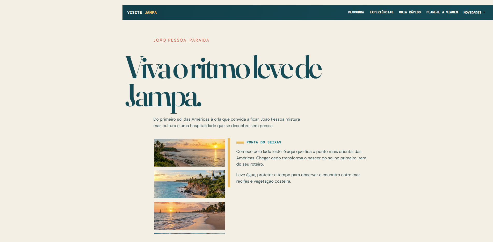

# Visite Jampa

<p align="center">
  
</p>

<p align="center">
  Uma landing page turística responsiva para apresentar João Pessoa, Paraíba.
</p>

## Sobre o projeto

O **Visite Jampa** reúne praias, cultura, artesanato e informações práticas da capital paraibana em uma experiência visual leve e interativa. Foi construído com HTML, CSS e JavaScript modular, sem framework no navegador.

## Destaques

- Navegação suave e responsiva.
- Roteiro de destinos com abas e controle por teclado.
- FAQ acessível em formato de acordeão.
- Galeria navegável por clique, arraste e miniaturas.
- Visualização ampliada das imagens por duplo clique.
- Indicadores carregados localmente e animados.
- Estilos organizados com tokens de design e componentes reutilizáveis.

## Desenvolvimento

```bash
npm install
npm run dev
```

## Qualidade e build

```bash
npm run lint
npm run build
```

O comando de build é compatível com Windows e com ambientes Linux, como o Vercel.

## Organização

- `index.html`: estrutura e conteúdo da página.
- `css/style.css`: tokens de design, layout, componentes e responsividade.
- `js/script.js`: ponto de inicialização das interações.
- `js/modules/`: componentes isolados (slide, modal, abas, acordeão e indicadores).
- `indicadores-jampa.json`: dados exibidos na seção de números.
- `img/jampa/`: imagens locais do projeto.

## Limites atuais

O formulário de novidades é demonstrativo; ele não envia dados. Para produção, conecte-o a uma API, função serverless ou serviço de formulários.

As informações, autoria e créditos de imagem estão em [CREDITOS.md](CREDITOS.md).
